# gluns-python-backend

# FASTAPI microservice

## Overview
This project is a Chat Application built using Spring , React and  FastAPI. The API handles user interactions with various contexts such as capital management, investment, and saving money. It utilizes an LLM (Large Language Model) for processing user queries and maintains chat history for each user. The application exposes endpoints for managing user inputs, contexts, and retrieving chat history.

## Useful Links

- Frontend: https://github.com/Kolman-Freecss/gluns-front
- Java Backend: https://github.com/Kolman-Freecss/gluns-spring/

## Tech Stack

- **Backend Framework**: FastAPI
- **Python Version**: 3.10+
- **Database**: In-memory dictionary (for mock chat history data)
- **AI Service**: ChatGroq(model=llama-3.1)
- **API Documentation**: Automatically generated by FastAPI at `/docs`
- **Development Tool**: Docker (for containerization)

## Features

- **Contexts**: Predefined contexts like CAPITAL_MANAGEMENT, INVESTMENT, SAVE_MONEY, etc.
- **User Inputs**: Users can provide input based on selected context.
- **Chat History**: Retrieve past interactions for a specific user based on chat history and user ID.
- **AI Integration**: The API integrates with an AI service to process user queries using historical data.


## Basic Flow
## Infrastructure

Flow Diagram:


## Key API Endpoints

### 1. `GET /api/v1/chat/contexts`
- **Description**: Retrieves a list of available contexts.
- **Response**:
  ```json
  {
    "message": "Contexts retrieved successfully",
    "body": [
      "CAPITAL_MANAGEMENT",
      "INVESTMENT",
      "SAVE_MONEY",
      "BILLS_BALANCE",
      "SUMMARY_INVOICES"
    ]
  }
  ```
### 2. `POST /api/v1/chat`
- **Description**: Handle user input with context and text.
- **Response**:
 ```json
    {
      "message": "User input processed successfully",
      "body": {
        "context": "CAPITAL_MANAGEMENT",
        "input": "How can I save more money?",
        "response": "Processed input for CAPITAL_MANAGEMENT"
      }
    }
	```
### 3. `GET /api/v1/{chatMessageID}`
- **Description**: Retrieve chat history for a specific user.
- **Response**:
```json
    {
      "history": [
        ["Hello, how can I save?", "Try saving 20% of your income"],
        ["What’s the best investment?", "Consider low-risk options like bonds"]
      ]
    }
```
### 4. `POST /api/v1/output`
- **Description**: Process user input with LLM using chat history for context.
- **Request Body**:
```json
Response:

{
  "output": "Processed chat history with LLM based on input and context."
}
```
### 5. `POST /api/v1/chat/{chatHistoryId}/{userId}`
- **Description**: Process user chat history using chathistoryid and userid
- **Request Body**:
```json
Response:
{
    "output": "Processed input for {user_input.context} with userId {user_input.userId} and chatHistoryId {chatHistoryId}"
}
```

### Running the Project Locally
## Pre-requisite
- Python 3.10 or higher
- Docker (optional, for containerized setup)
- Groq token
  Generate a  free API token 
  https://console.groq.com/keys
  Then create a .env file and the following
  ``
  GROQ_API_KEY=YOUR-API-KEY
  ``
Yes, it will work!

1. Locally without docker
```
git clone <repository-url>
cd python-back

pip install -r requirements.txt

uvicorn main:app --reload
```
The application will be running at http://localhost:8000.
Access the interactive Swagger UI documentation at http://localhost:8000/docs.

2. Docker

```
git clone <repository-url>
cd python-back
docker compose build
docker compose up -d 
```
The application will be running at http://localhost:8000 inside the Docker container.
Access the interactive Swagger UI documentation at http://localhost:8000/docs.

- **References**: 
- FastAPI Documentation: https://fastapi.tiangolo.com/
- Python 3.10 Documentation: https://docs.python.org/3.10/
- Pydantic Documentation: https://pydantic-docs.helpmanual.io/
- Docker Documentation: https://docs.docker.com/
- Uvicorn ASGI Server: https://www.uvicorn.org/
